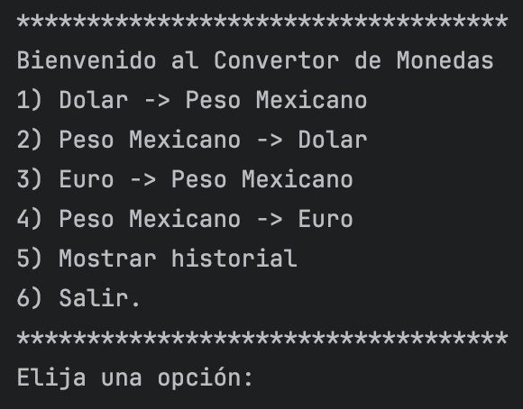
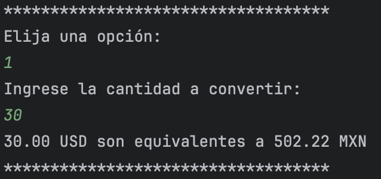

# Conversor de divisas 🪙

Este proyecto es un convertidor de monedas en Java que utiliza un llamado a una API 
para obtener los tipos de cambio actuales y permite convertir entre varias divisas. 
Además mantiene un historial de conversiones el cuál se puede visualizar.

## Funcionalidades

- Convertir entre varias divisas (USD, MNX, EUR,  <em>próximamente más</em>).
- Registrar y mostrar el historial de conversiones.

## Requisitos del Sistema

- Java 8 o superior.
- Biblioteca Gson para parsear el JSON de la API.
- Conexión a internet para obtener las divisas actuales.
- Algun IDE de desarrollo de Java.

## Instalación

- Clonar el repositorio o descargar los archivos fuentes 
`https://github.com/Marco1595/conversorDeMoneda.git`
- Asegurarse de tener Java instalado en tu sistema.
- Añadir la biblioteca Gson. Puedes descargarlo desde
`[Maven Repository]https://mvnrepository.com/artifact/com.google.code.gson/gson`

## Uso 

- Al iniciar la aplicación, se te pedirá que selecciones la divisa deseada para realizar su conversión.
- Después tendrás que introduccir la cantidad a convertir.
- La aplicación calculará automáticamente el monto convertido y lo mostrará. Al mismo tiempo creará un archivo .txt en el que se guardara el historial.
- Puedes realizar otra conversión o revisar el historial.
- Para salir se debe escoger la opción 6. 

## Ejemplo

Al inciar el programa aparece un menú para escoger el tipo de cambio que deseas elegir

A continuación, debemos ingresar la cantidad a convertir

Por último, podemos selecciónar el historial de conversiones para visualizar todas las que se han realizado

## Autor

- Marco Carrillo [@Marco1595](https://github.com/Marco1595)

## Agradecimiento

Agradecimiento especialmente al equipo de Alura por el material y el contenido del curso.
